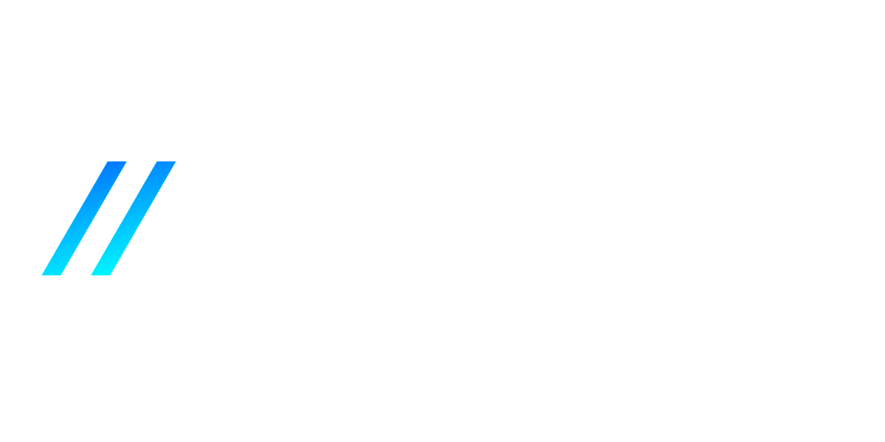

  

 

 

<h2>😄 About Me</h2>

 
 
**`Digital Craftsman (Developer/Editor/Creator)`**

I am a 25-year-old programmer with a huge passion for things such as software development and game development. I have been programming since I was 13 years old and first started making games in Microsoft PowerPoint. I specialize in designing and writing programs and games and am open to trying anything that utilizes a language that I am familiar with! Though most of the projects currently may be related to Unreal Engine and C++, as this is what my university focused on, I am the most comfortable and have the most experience (10+ years) with Unity and C#! I can't wait to see what we can create!

- 🔭 I’m currently working on: <b>Some personal projects for fun!</b>
- 🌱 I’m currently learning: <b>Custom editors in Unity using UI Toolkit</b>
- 📫 How to reach me: <b>liam.m.rand@gmail.com</b>

  

      
      
      

#

 

<h2>🛠️ My Favorite Tools</h2>

 
### ⌨️ Languages

 
 

### 🧰 Tools

 

 

#

 
  
<h2>📖 My Favorite Projects</h2>

  <!-- Repo info cards - https://github.com/anuraghazra/github-readme-stats -->
  <!-- Small repo cards (fork) - https://github.com/DenverCoder1/github-readme-stats -->
  

    
    
    
    
  

  

#

 

<h2>📊 Github Stats</h2>

  
 
 
 <b>NOTE:</b> Top languages is only a metric of the languages my public code consists of and doesn't reflect experience or skill level.
 
 

  

